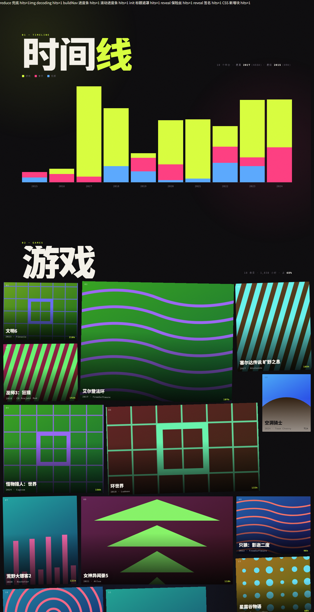



**在线打开：** https://sonnet0112.github.io/life-in-screens/

---
# 我的人生去哪了

单文件 HTML 的个人娱乐数据叙事页。**双击 `index.html` 就能看**，不需要任何构建步骤、不需要服务器。

拿你的 Steam / B站 / 音乐记录填进去，它会变成一面属于你的墙。

---

## 五屏

| # | 内容 |
|---|---|
| 0 | 开场数字 —— 全部时长换算成天数 |
| 1 | 时间线 —— 年份天际线，按游戏/音乐/视频三色堆叠 |
| 2 | 游戏 —— 拼贴墙 |
| 3 | 音乐 —— 拼贴墙 |
| 4 | 视频 —— 拼贴墙 + 「星期 × 小时」作息热力图 |

---

## 换成你自己的数据

`data/` 里的 JSON 是唯一的数据源，`tools/fetch_data.py` 负责抓取和写回页面。

### Steam —— 优先做这个

官方 API，一次请求拿到全部游戏时长，零阻力。

1. 申请 Key：<https://steamcommunity.com/dev/apikey>（免费，域名随便填）
2. 查 SteamID64：<https://steamid.io>
3. **把「游戏详情」隐私设为公开**：Steam → 个人资料 → 编辑个人资料 → 隐私设置
   （不设的话 API 会返回空列表，脚本会提示你）
4. 运行：

```bash
python tools/fetch_data.py steam --key <你的KEY> --steamid <你的SteamID64>
python tools/fetch_data.py patch
```

竖版封面更好看的话加 `--art library`（默认 `header` 横版最稳）。

### B站 —— 只有它能给热力图提供真实时刻

```bash
python tools/fetch_data.py bilibili --sessdata <SESSDATA>
python tools/fetch_data.py patch
```

SESSDATA 的拿法：登录 bilibili.com → F12 → Application → Cookies → `https://www.bilibili.com` → 复制 `SESSDATA` 的值。

抓完会顺带算出真实的「星期 × 小时」矩阵，热力图那一屏就变成你真实的作息。

### 音乐 —— 国内平台都没有官方 API

走 CSV 手工导入：

```bash
python tools/fetch_data.py music --template    # 生成 data/music.csv 模板
# 打开填好每一行
python tools/fetch_data.py music
python tools/fetch_data.py patch
```

### 不想联网？先跑一遍看效果

```bash
python tools/fetch_data.py demo
python tools/fetch_data.py patch
```

---

## 目录

```
index.html            页面本体（单文件，样式和逻辑全在里面）
tools/fetch_data.py   数据抓取 + 写回页面
data/00-sample.json   演示数据（48 条）。有真实数据后建议删掉，
                      否则 patch 时会一起合并进来
covers/               本地封面图，可选
```

---

## 需要知道的几件事

- `patch` 写入前会**自动备份**成 `index.html.bak`。
- 抓取只在你本机跑，**凭据不落盘**（只走命令行参数或环境变量）。
- **Steam 的年份是「最后一次游玩的年份」**。Steam 不提供逐年游玩分布，所以时间线
  那一屏对 Steam 数据是近似值，不是精确分布。
- **B站只保留最近一段时间的观看历史**，所以那只是你观看记录的一部分。
- 封面图加载失败会自动退回程序生成的几何封面，不会出现空白砖块。
- 想手动改数据也可以：编辑 `data/*.json` 再 `patch`，或直接改 `index.html` 里
  `/* ==== DATA:BEGIN ==== */` 和 `/* ==== DATA:END ==== */` 之间的部分（会被 patch 覆盖）。

